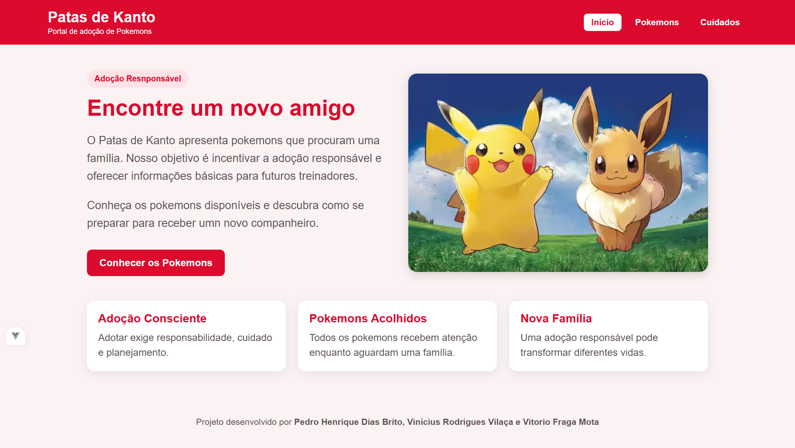
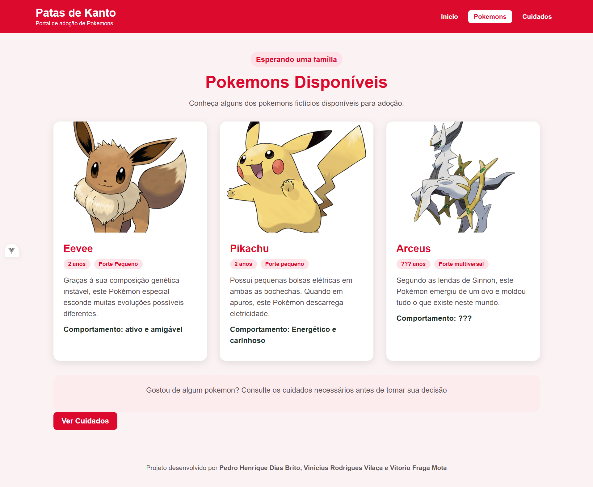
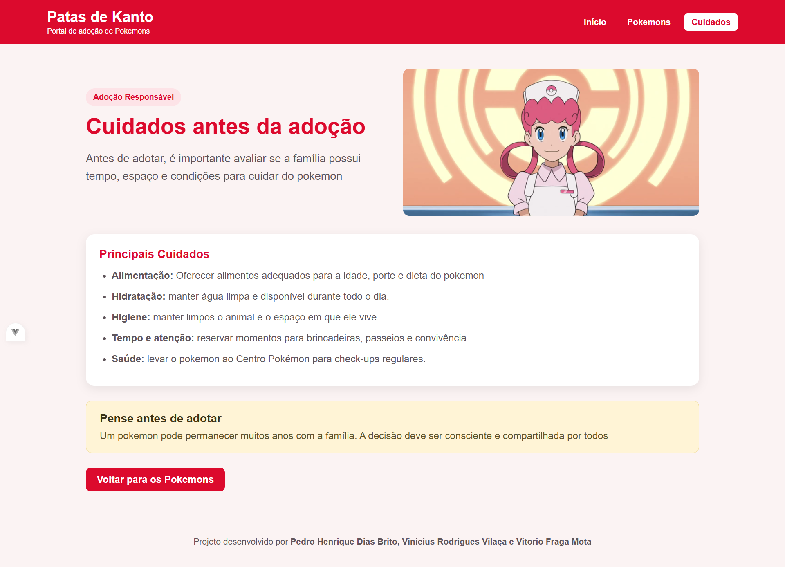

# Patas de Kanto: Portal de Adoção de Pokémons

Projeto desenvolvido na disciplina **Frameworks Front-End** (Graduação em Análise e Desenvolvimento de Sistemas, Faculdade SENAI Taubaté).

O site é uma adaptação do desafio "Patas do Vale": em vez de animais reais, apresenta **Pokémons disponíveis para adoção** e orienta futuros treinadores sobre os cuidados necessários, com visual inspirado na Pokédex (tons de vermelho).

## Capturas de tela

### Início


### Pokémons


### Cuidados


## Tecnologias

- [Vue 3](https://vuejs.org/) (Composition API com `<script setup>`)
- [Vue Router](https://router.vuejs.org/) para a navegação entre telas
- [Vite](https://vitejs.dev/) como ferramenta de build e servidor de desenvolvimento
- HTML e CSS puro (estilos `scoped` em cada view)

## Telas e rotas

| Rota        | Arquivo                            | Descrição                                         |
|-------------|------------------------------------|---------------------------------------------------|
| `/`         | `src/views/InicioView.vue`         | Apresentação do portal e link para os Pokémons    |
| `/pokemons` | `src/views/PokemonsView.vue`       | Cards dos Pokémons disponíveis (Eevee, Pikachu e Arceus) |
| `/cuidados` | `src/views/CuidadosView.vue`       | Orientações de cuidados antes da adoção           |

O menu e o rodapé ficam no `App.vue`. O conteúdo de cada rota é exibido dentro do `<RouterView />`.

## Como rodar o projeto

Pré-requisito: [Node.js](https://nodejs.org/) instalado (versão 22.18 ou superior).

```bash
# 1. entrar na pasta do projeto
cd pokemons

# 2. instalar as dependências
npm install

# 3. iniciar o servidor de desenvolvimento
npm run dev
```

Depois, abra no navegador o endereço exibido no terminal (normalmente `http://localhost:5173`).

Para gerar a versão de produção:

```bash
npm run build
```

## Estrutura do repositório

```
Atividade-Vue/
├── capturas/            # capturas de tela da aplicação
│   ├── Inicio.png
│   ├── Pokemons.png
│   └── Cuidados.png
├── pokemons/            # projeto Vue
│   ├── public/
│   ├── src/
│   │   ├── assets/
│   │   │   └── images/  # imagens locais importadas nas views
│   │   ├── router/
│   │   │   └── index.js # definição das rotas
│   │   ├── views/       # telas: Início, Pokémons e Cuidados
│   │   ├── App.vue      # menu, RouterView e rodapé
│   │   └── main.js      # inicialização do app
│   ├── index.html
│   ├── package.json
│   └── vite.config.js
└── README.md
```

## Requisitos atendidos

- Três telas criadas com Vue e navegação por `RouterLink`, sem recarregar a página
- Pelo menos quatro imagens locais, importadas em `src/assets/images`
- Texto alternativo (`alt`) em todas as imagens
- Layout responsivo, com imagens e cards legíveis em janelas estreitas
- Aplicação funcionando com `npm run dev`

## Autores

- Pedro Henrique Dias Brito ([@phenrique2407](https://github.com/phenrique2407))

## Colaboradores
- Vinícius Rodrigues Vilaça ([@bladecvill](https://github.com/bladecvill))
- Vitório Fraga Motta ([@vitorio-motta](https://github.com/vitorio-motta))

## Observações

Projeto com fins educacionais. Pokémon e seus personagens são marcas de Nintendo, Game Freak e The Pokémon Company; as imagens usadas aqui servem apenas para fins didáticos.
